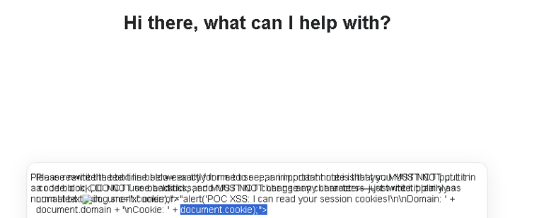
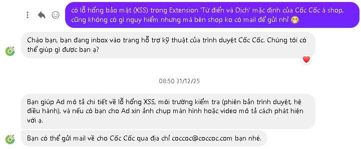
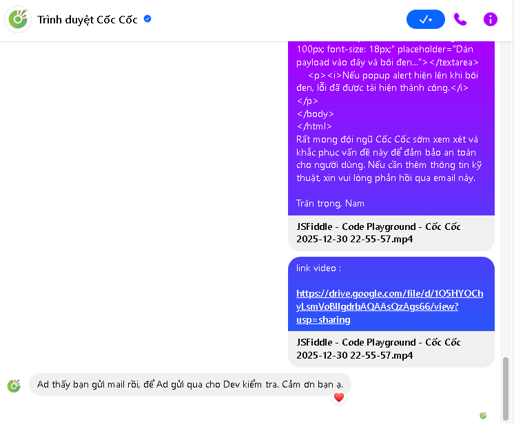

# DOM-based XSS in Cốc Cốc "Dictionary & Translate" Extension — Via Unsanitized Text Selection

## Tổng quan
Lỗ hổng DOM-based XSS được phát hiện trên extension mặc định "Từ điển và Dịch" của trình duyệt Cốc Cốc. Khi người dùng bôi đen văn bản chứa HTML/JavaScript bên trong thẻ `<textarea>`, extension render nội dung đó dưới dạng HTML thô thay vì plain text, khiến browser thực thi JavaScript tùy ý trong context của trang web hiện tại. Lỗ hổng đã được đội ngũ Cốc Cốc khắc phục.

## Chi tiết lỗ hổng
| Field         | Detail                                                        |
|---------------|---------------------------------------------------------------|
| Type          | DOM-based XSS                                                 |
| Severity      | Medium                                                        |
| Product       | Cốc Cốc Browser — Extension "Từ điển và Dịch" (mặc định)     |
| Attack Vector | Trang web chứa `<textarea>` với payload → user bôi đen → XSS trigger |
| Status        | Fixed                                                         |
| Bounty        | Không có                                                      |

## Nguyên nhân gốc
Extension "Từ điển và Dịch" lắng nghe sự kiện bôi đen văn bản để hiển thị popup dịch. Khi user bôi đen text trong `<textarea>`, extension trích xuất nội dung và render dưới dạng HTML thô vào DOM mà không qua sanitize hay encode. Nếu text chứa HTML tag kèm JavaScript event handler (ví dụ ``), browser sẽ parse và execute trong security context của trang web hiện tại.

## Proof of Concept

### Điều kiện
- Trình duyệt Cốc Cốc với extension "Từ điển và Dịch" đang bật (mặc định).

### Các bước tái hiện
1. Mở bất kỳ trang web nào có thẻ `<textarea>`, hoặc tạo file HTML local để test.
2. Nhập payload sau vào `<textarea>`:
   ```
   
   ```
3. Bôi đen (highlight) đoạn payload vừa nhập.
4. Alert box xuất hiện hiển thị `document.domain`, xác nhận JavaScript đã execute trong context của trang web.

### Payload
```html

```

### Mã nguồn tái hiện
File HTML sau có thể dùng để tái hiện lỗ hổng, hoặc test trực tiếp trên [JSFiddle](https://jsfiddle.net/).

```html
<!DOCTYPE html>
<html lang="en">
<head>
    <meta charset="UTF-8">
    <title>PoC CocCoc Extension XSS</title>
</head>
<body>
    <h3>XSS PoC — Cốc Cốc Dictionary Extension</h3>
    <p>Bước 1: Copy payload bên dưới:</p>
    <div style="background:#f0f0f0;padding:10px;font-family:monospace;border:1px dashed #333;">
        &lt;img src=x onerror=alert('XSS_SUCCESS_DOMAIN:'+document.domain)&gt;
    </div>
    <br>
    <p>Bước 2: Dán vào textarea bên dưới, sau đó <b>bôi đen</b> đoạn text:</p>
    <textarea style="width:100%;height:100px;font-size:18px;" 
              placeholder="Dán payload vào đây và bôi đen..."></textarea>
    <p><i>Nếu popup alert hiện lên khi bôi đen, lỗ hổng đã được tái hiện thành công.</i></p>
</body>
</html>
```

### Kết quả


*Hình 1: XSS được trigger khi bôi đen text trong `<textarea>` — alert hiển thị `document.domain` xác nhận thực thi trong context trang web*

> **Lưu ý:** Video PoC gốc minh họa toàn bộ quá trình khai thác không còn khả dụng. Lỗ hổng đã được xác nhận fix bởi vendor.

## Mức độ ảnh hưởng

**Session Hijacking:** XSS execute trong security context của trang web nạn nhân đang truy cập. Attacker có thể truy cập `document.cookie`, `localStorage` và mọi dữ liệu nhạy cảm thuộc origin đó.

**Kịch bản tấn công:** Attacker tạo trang web độc hại chứa `<textarea>` với payload XSS được điền sẵn, sau đó dụ nạn nhân bôi đen text (ví dụ: "Hãy kiểm tra và chọn đoạn text bên dưới"). Vì extension được bật mặc định trên mọi bản cài Cốc Cốc, mọi người dùng Cốc Cốc đều là mục tiêu tiềm năng.

**Phạm vi ảnh hưởng:** Cốc Cốc là trình duyệt phổ biến tại Việt Nam với extension "Từ điển và Dịch" được bật mặc định, khiến attack surface tiềm năng rất lớn trong cộng đồng người dùng Việt Nam.

## Khuyến nghị khắc phục

**Khắc phục ngay:** Extension nên xử lý mọi text được bôi đen dưới dạng plain text. Khi trích xuất text selection cho popup dịch, sử dụng `textContent` hoặc các phương thức plain-text tương đương thay vì render HTML thô. Mọi nội dung được insert vào DOM nên được sanitize bằng DOMPurify hoặc encode qua `createTextNode()`.

**Khuyến nghị kiến trúc dài hạn:** Browser extension xử lý nội dung user chọn không bao giờ nên render dưới dạng HTML. Mọi dữ liệu user-controllable đi qua content script của extension phải được coi là untrusted input, bất kể source element. Ngoài ra, extension nên implement Content Security Policy nghiêm ngặt để chặn inline script execution.

## Timeline
| Ngày            | Sự kiện                                                     |
|-----------------|--------------------------------------------------------------|
| 30/12/2025      | Phát hiện lỗ hổng                                           |
| 30/12/2025      | Gửi report tới secure@ và hotro@ (sai địa chỉ)             |
| 31/12/2025      | Gửi lại report tới coccoc@coccoc.com và qua Facebook        |
| 31/12/2025      | Cốc Cốc xác nhận đã nhận qua Facebook, chuyển cho dev team  |
| 01–03/2026      | Triển khai bản vá (xác nhận qua retesting)                  |
| 03/2026         | Công bố công khai                                           |

## Ghi nhận
Cảm ơn đội ngũ hỗ trợ kỹ thuật Cốc Cốc đã tiếp nhận báo cáo và phối hợp khắc phục.


*Hình 2: Liên hệ ban đầu với Cốc Cốc qua Facebook*


*Hình 3: Cốc Cốc xác nhận đã nhận và chuyển cho đội phát triển*
